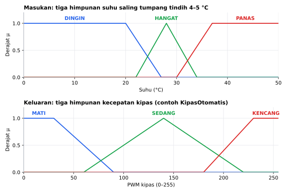
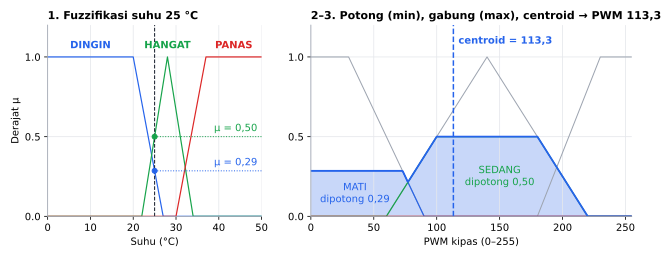
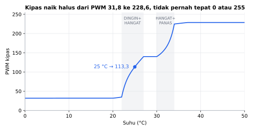
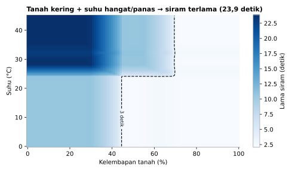

# LogikaFuzzy

[English](README.en.md)

Library Arduino berbahasa Indonesia untuk **logika fuzzy** Mamdani dan Sugeno orde-0. Aturan ditulis seperti di laporan skripsi, dan setiap tahap perhitungan bisa dibaca untuk dicocokkan dengan hitungan manual atau MATLAB.

```cpp
fuzzy.jika(DINGIN).dan(KERING).maka(PELAN);
fuzzy.jika(PANAS).atau(LEMBAP).maka(KENCANG);
```

## Fitur

- **Aturan yang terbaca**: `jika(A).dan(B).maka(C)`, sama seperti tabel aturan di laporan.
- **Himpunan segitiga dan trapesium**: `segitiga(a, b, c)`, `trapesium(a, b, c, d)`.
- **Mamdani**: DAN = min, ATAU = max, implikasi min, agregasi max, defuzzifikasi **centroid** dengan resolusi yang bisa diatur (default 101 titik).
- **Sugeno orde-0**: keluaran konstanta, hasil rata-rata berbobot. Lebih ringan karena tanpa centroid.
- **Setiap tahap bisa dibaca**: `derajat()` untuk fuzzifikasi, `kekuatan()` untuk tiap aturan, `keluaran()` untuk hasil akhir.
- **Metode sama dengan bawaan MATLAB** (Mamdani), termasuk masukan di luar semesta yang dipotong ke batasnya.
- **Tanpa alokasi dinamis**: tidak ada `new` atau `malloc`. Kapasitas ditentukan lewat template, jadi pemakaian RAM sudah terlihat saat compile.
- **Hemat RAM**: sistem 2 masukan × 3 himpunan, 1 keluaran, 9 aturan memakai **227 byte** di Arduino Uno.

## Board yang didukung

| Board | Teruji compile |
|---|---|
| Arduino Uno / Nano | ✅ |
| Arduino Mega | ✅ |
| ESP32 DevKit | ✅ |
| ESP32-C3 / S3 | ✅ |
| STM32 Blackpill F411 | ✅ |
| STM32 Bluepill F103 | ✅ |

Library ini murni perangkat lunak (hanya `float`), jadi seharusnya bekerja di board Arduino apa pun.

## Instalasi

**Library Manager:** Arduino IDE → *Sketch → Include Library → Manage Libraries…* → cari **LogikaFuzzy** → *Install*.

**Manual:** unduh ZIP dari GitHub → *Sketch → Include Library → Add .ZIP Library…*

## Contoh cepat

```cpp
#include <LogikaFuzzy.h>

// 1 masukan, 1 keluaran, maksimal 2 himpunan per variabel, 2 aturan.
LogikaFuzzy<1, 1, 2, 2> fuzzy;
uint8_t suhu, kipas;

void setup() {
  Serial.begin(115200);

  suhu = fuzzy.tambahMasukan(0, 40);     // semesta 0..40 °C
  kipas = fuzzy.tambahKeluaran(0, 100);  // semesta 0..100 %

  uint8_t DINGIN = fuzzy.tambahHimpunan(suhu, trapesium(0, 0, 10, 30));
  uint8_t PANAS = fuzzy.tambahHimpunan(suhu, trapesium(10, 30, 40, 40));
  uint8_t PELAN = fuzzy.tambahHimpunan(kipas, trapesium(0, 0, 20, 60));
  uint8_t CEPAT = fuzzy.tambahHimpunan(kipas, trapesium(40, 80, 100, 100));

  fuzzy.jika(DINGIN).maka(PELAN);
  fuzzy.jika(PANAS).maka(CEPAT);
}

void loop() {
  fuzzy.masukan(suhu, 18);
  fuzzy.hitung();
  Serial.println(fuzzy.keluaran(kipas)); // 44.86
  delay(1000);
}
```

Susun variabel, himpunan, dan aturan sekali di `setup()`. Di `loop()` cukup `masukan()`, `hitung()`, lalu `keluaran()`.

## Hasil simulasi

Semua grafik di bawah adalah **simulasi** di PC yang menjalankan kode library ini dengan sistem yang sama persis dengan contoh `KipasOtomatis` dan `PenyiramTanaman`, bukan pengukuran hardware.



Himpunan masukan dan keluaran contoh `KipasOtomatis`. Daerah tumpang tindih (22–27 °C dan 30–34 °C) adalah tempat dua aturan aktif bersamaan.



Langkah yang biasa ditulis di laporan, untuk suhu 25 °C: μ DINGIN = 0,29 dan μ HANGAT = 0,50 memotong MATI dan SEDANG (implikasi min), potongannya digabung (agregasi max, area biru), lalu centroid area itu menjadi keluaran: PWM 113,25.



Keluaran untuk seluruh semesta suhu. Di luar daerah tumpang tindih PWM datar. Centroid tidak pernah mencapai ujung semesta, jadi kipas paling pelan PWM 31,8 dan paling kencang 228,6. Jika kipas harus benar-benar mati, tambahkan ambang di program (mis. PWM < 40 → 0).



Contoh `PenyiramTanaman` (2 masukan, 9 aturan) untuk semua kombinasi tanah 0–100 % dan suhu 0–45 °C. Garis putus-putus adalah batas 3 detik: di kanannya pompa tidak dinyalakan.

Grafik dibuat dari simulasi di PC yang menjalankan kode library ini (`extras/simulasi`):
```sh
cd extras/simulasi
python gambar.py   # butuh g++ dan matplotlib
```

## Kecepatan & memori

Diukur dengan simavr (simulator ATmega328P yang akurat per siklus) di Arduino Uno 16 MHz, memakai sistem contoh `KipasOtomatis` dan `PenyiramTanaman`. Pembanding: eFLL 1.5.1 dengan himpunan dan aturan yang sama.

| `hitung()` | LogikaFuzzy 1.0.1 | LogikaFuzzy 1.0.0 | eFLL 1.5.1 (`fuzzify` + `defuzzify`) |
|---|---|---|---|
| Kipas, 25 °C (2 aturan aktif) | 121.320 siklus (7,6 ms) | 340.354 (21,3 ms) | 40.832 (2,6 ms) |
| Kipas, 10 °C (1 aturan aktif) | 46.021 (2,9 ms) | 331.273 (20,7 ms) | 8.448 (0,5 ms) |
| Penyiram, 9 aturan (4 aktif) | 158.640 (9,9 ms) | 344.367 (21,5 ms) | - |
| Kipas, 25 °C, `aturResolusi(21)` | 44.288 (2,8 ms) | 73.236 (4,6 ms) | - |
| Hasil kipas 25 °C | 113,25 (sama dengan MATLAB) | 113,25 | 113,77 |
| Flash sketch kipas yang setara | 9.104 B | 7.264 B | 11.680 B |
| RAM | 138 B (objek, statis) | 138 B | di heap, berubah tiap `fuzzify()` |

`hitung()` O(A·M + R·n) waktu: A aturan × M masukan untuk kekuatan aturan, lalu R titik centroid (default 101) × n himpunan keluaran yang terkena aturan. Memori tambahan O(H) di stack.

Optimasi di 1.0.1 (hasil sama dengan centroid apa adanya sampai 0,001, diuji di `extras/test` untuk 4 resolusi dan semua masukan contoh):
- Kekuatan tiap aturan dihitung sekali, aturan DAN berhenti begitu derajatnya 0.
- Centroid hanya memakai himpunan keluaran yang terkena aturan dan hanya titik di dalam alasnya. Batas sisi tiap himpunan diubah sekali menjadi nomor titik, sehingga di dalam loop tidak ada pembagian dan tidak ada pembanding float.
- Hasilnya 2,2–7× lebih cepat. Harganya ±2 KB flash, karena kode centroid lebih panjang.

Di mana kita kalah: eFLL 3–5× lebih cepat karena menghitung centroid secara geometris (luas poligon), bukan di 101 titik. LogikaFuzzy sengaja memakai centroid diskret 101 titik seperti MATLAB agar hasilnya bisa dicocokkan dengan laporan; jika kecepatan lebih penting, turunkan `aturResolusi()` (21 titik: 2,8 ms, hasil 111,43). eFLL memakai heap yang berubah tiap `fuzzify()`; LogikaFuzzy tidak memakai alokasi dinamis.

Di ESP32 dan STM32 `src/` bebas promosi `float` → `double` (`-Wdouble-promotion`). Mengulang pengukuran: sketch `extras/benchmark/LogikaFuzzyBenchmark` (butuh simavr).

## Kapasitas

Angka di dalam `< >` adalah kapasitas maksimal, bukan jumlah yang wajib dipakai:

```cpp
LogikaFuzzy<MASUKAN, KELUARAN, HIMPUNAN, ATURAN> fuzzy;
```

`HIMPUNAN` adalah jumlah himpunan terbanyak di satu variabel. Jika kapasitas penuh, fungsi `tambah...()` mengembalikan `TIDAK_ADA` dan `maka()` mengembalikan `false`.

## Mencocokkan dengan laporan

Contoh `CocokkanHitunganManual` mencetak setiap tahap:

```
1. Fuzzifikasi
  mu DINGIN = 0.6000
  mu PANAS = 0.4000
  mu KERING = 0.7500
  mu BASAH = 0.2500
2. Kekuatan aturan (DAN = min)
  R1 = 0.6000
  R2 = 0.2500
  R3 = 0.4000
  R4 = 0.2500
3. Komposisi (max per himpunan keluaran)
  mu PELAN = 0.6000
  mu CEPAT = 0.4000
4. Defuzzifikasi centroid (101 titik)
  kipas = 44.8634
```

Nilai di atas dihitung dengan kode yang sama di PC, belum dibandingkan langsung dengan MATLAB.

Hal yang perlu disamakan dengan hitungan manual atau MATLAB:

| Hal | LogikaFuzzy | MATLAB |
|---|---|---|
| DAN / ATAU | min / max | Mamdani: min / max. Sugeno: **prod** / max, ubah *And method* ke `min` |
| Implikasi / agregasi | min / max | min / max |
| Defuzzifikasi | centroid diskret, 101 titik | centroid, 101 titik (*NumSamplePoints*) |
| Masukan di luar semesta | dipotong ke batas | dipotong ke batas |
| Tidak ada aturan aktif | titik tengah semesta, `hitung()` = `false` | titik tengah semesta + peringatan |

Hitungan tangan centroid biasanya memakai titik yang lebih sedikit. Samakan dengan `aturResolusi()`. Contoh: `aturResolusi(11)` pada semesta 0..100 memakai titik 0, 10, 20, …, 100, sama seperti tabel di laporan. Hitungan lengkapnya ada di komentar `extras/test/uji.cpp`.

Aturan memakai satu jenis operator. `jika(A).dan(B).atau(C)` ditolak (`maka()` = `false`) agar tidak ada keraguan urutan hitung. Pecah menjadi dua aturan.

## Referensi fungsi

### Himpunan

| Fungsi | Keterangan |
|---|---|
| `segitiga(a, b, c)` | Naik dari `a`, puncak di `b`, turun sampai `c`. |
| `trapesium(a, b, c, d)` | Naik dari `a`, datar `b`..`c`, turun sampai `d`. Bahu kiri: `a == b`. Bahu kanan: `c == d`. |
| `konstanta(k)` | Keluaran Sugeno orde-0. |
| `float h.derajat(x)` | Derajat keanggotaan `x` pada himpunan `h`. |

### Menyusun sistem

| Fungsi | Keterangan |
|---|---|
| `uint8_t tambahMasukan(min, max)` | Variabel masukan dengan semestanya. |
| `uint8_t tambahKeluaran(min, max)` | Variabel keluaran Mamdani. |
| `uint8_t tambahKeluaranSugeno()` | Variabel keluaran Sugeno orde-0. |
| `uint8_t tambahHimpunan(variabel, himpunan)` | Mengembalikan id himpunan untuk aturan. |
| `jika(h).dan(h)...maka(h)` | Aturan dengan DAN (min). `maka()` mengembalikan `false` jika penuh atau tidak sah. |
| `jika(h).atau(h)...maka(h)` | Aturan dengan ATAU (max). |
| `aturResolusi(titik)` | Jumlah titik centroid, default 101. |

Fungsi `tambah...()` mengembalikan `TIDAK_ADA` jika kapasitas penuh.

### Menghitung dan membaca hasil

| Fungsi | Keterangan |
|---|---|
| `bool masukan(variabel, nilai)` | Mengisi nilai masukan. Di luar semesta dipotong ke batasnya. |
| `bool hitung()` | Menghitung semua keluaran. `false` jika ada keluaran yang tidak terkena aturan apa pun. |
| `float keluaran(variabel)` | Hasil `hitung()` terakhir. |
| `float derajat(himpunan)` | Himpunan masukan: derajat keanggotaan nilai saat ini. Himpunan keluaran: kekuatan terbesar dari aturan yang menuju himpunan itu. |
| `float kekuatan(i)` | Kekuatan aturan ke-`i` (0 = aturan pertama). |
| `uint8_t jumlahAturan()` | Jumlah aturan yang tersimpan. |

## Contoh yang tersedia

*File → Examples → LogikaFuzzy*

| Contoh | Isi |
|---|---|
| `KipasOtomatis` | Suhu LM35 → kecepatan kipas (PWM). |
| `PenyiramTanaman` | Kelembapan tanah + suhu → lama siram, 9 aturan, pompa non-blocking. |
| `CocokkanHitunganManual` | Mencetak fuzzifikasi, kekuatan aturan, komposisi, dan hasil untuk laporan. |
| `SugenoSederhana` | Jarak halangan → kecepatan robot dengan Sugeno orde-0. |

## Dibanding library lain

Library fuzzy di Library Manager hanya sedikit. Dibaca dari source code-nya (Oktober 2026):

| | LogikaFuzzy | eFLL 1.5.1 | qlibs (fis) |
|---|---|---|---|
| Bahasa API | Indonesia | Inggris | Inggris |
| Alokasi dinamis | tidak ada | `malloc` untuk setiap variabel, himpunan, dan aturan; `malloc`/`free` setiap titik komposisi di setiap `fuzzify()` | tidak ada |
| Mamdani / Sugeno | ✅ / ✅ | ✅ / ❌ | ✅ / ✅ (juga Tsukamoto) |
| Aturan dengan 3 syarat | satu baris | perlu objek antecedent bertingkat (`joinWithAND` menerima dua) | satu baris (makro) |
| Kekuatan tiap aturan | `kekuatan(i)` | hanya aktif/tidak (`isFiredRule()`) | ✅ (array yang disiapkan pengguna) |

qlibs adalah koleksi besar (fuzzy, PID, filter, dll.) dengan fitur fuzzy yang lebih lengkap. LogikaFuzzy sengaja lebih kecil dan berfokus pada kebutuhan tugas akhir dan robot.

## Pengujian

Derajat keanggotaan, satu aturan, dua aturan yang dihitung tangan, DAN/ATAU, Sugeno, masukan di luar semesta, dan kapasitas penuh diuji otomatis di PC (`extras/test`) setiap ada perubahan:

```sh
cd extras/test
g++ -std=c++11 -I. -I../../src uji.cpp ../../src/*.cpp -o uji && ./uji
```

## Status

Versi 1.0.1 sudah lolos uji logika otomatis di PC dan compile di 7 board. Library ini murni perangkat lunak, jadi tidak bergantung pada hardware tertentu. Jika menemukan masalah, silakan buka *issue* di GitHub.

## Lisensi

MIT © 2026 Amadeo Wisesa. Lihat [LICENSE](LICENSE).
